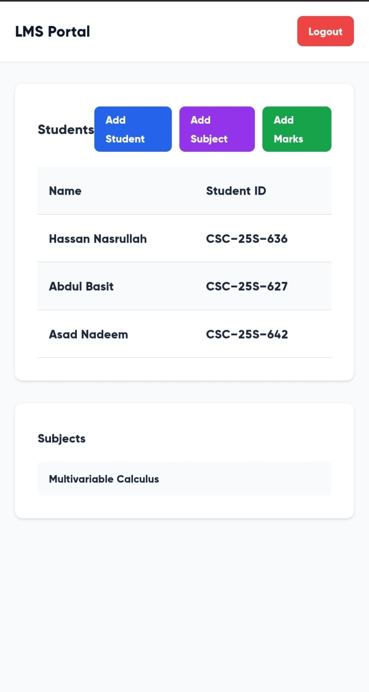
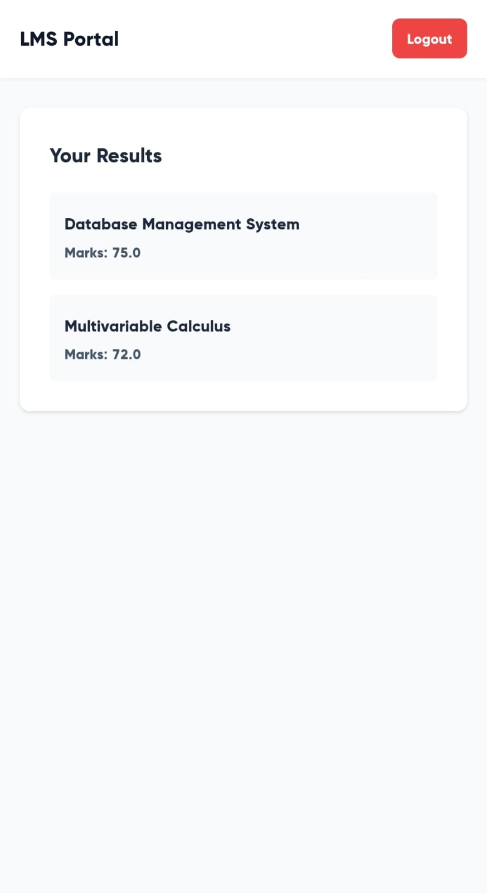
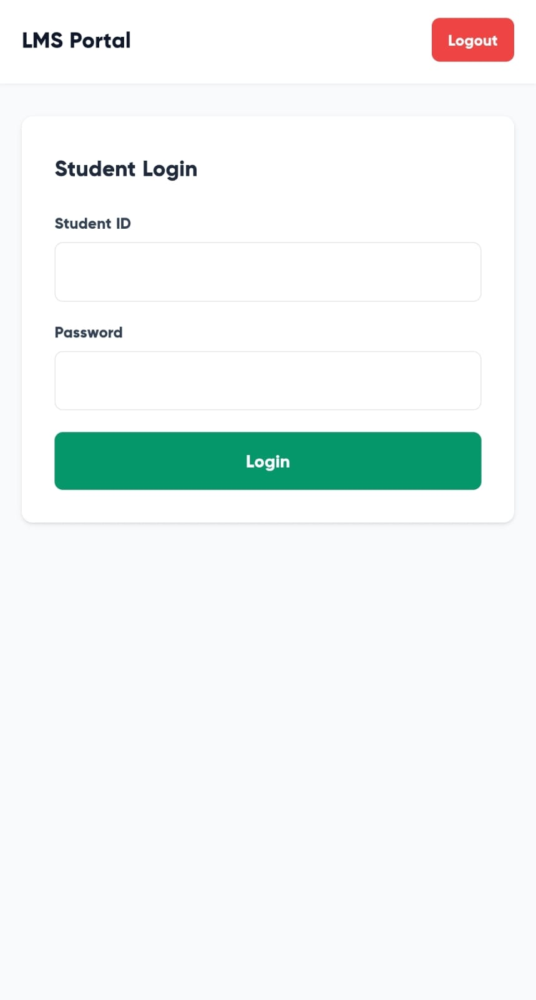

# Flask LMS Portal


A Learning Management System (LMS) portal built with Flask where teachers can manage students, subjects, and marks, while students can view their academic performance.

## Features

### Teacher Portal
- **Secure Registration** - Teachers register using a secret key given by admin
- **Student Management** - Add and manage student accounts with custom credentials
- **Subject Management** - Create and organize subjects
- **Grade Management** - Add student marks for each subject

### Student Portal
- **Secure Login** - Students log in with teacher-provided credentials
- **Dashboard** - View marks across all subjects
- **Real-time Updates** - Access updated grades instantly

## Tech Stack

- **Backend**: Python Flask
- **Database**: MySQL (hosted on Railway)
- **Authentication**: Flask-Login
- **Frontend**: HTML, Tailwind CSS
- **ORM**: SQLAlchemy (implied by Flask structure)

## Project Structure

```
FLASK_LMS_PORTAL/
├── __pycache__/          # Python cache files
├── .git/                 # Git repository
├── instance/             # Instance-specific configuration
├── llm/                  # Virtual environment (I accidently named this llm)
├── templates/            # HTML templates
│   ├── add_marks.html
│   ├── add_student.html
│   ├── add_subject.html
│   ├── base.html
│   ├── home.html
│   ├── student_dashboard.html
│   ├── student_login.html
│   ├── teacher_dashboard.html
│   ├── teacher_login.html
│   └── teacher_register.html
├── .env                  # Environment variables
├── .gitignore
├── main.py               # Application entry point
├── models.py             # Database models
├── Readme.md
├── requirements.txt      # Python dependencies
├── vercel.json          # Vercel deployment config
└── wsgi.py              # WSGI application
```

## Database Schema

The system uses a **many-to-many** relationship between Students and Subjects:

- **Teachers** table - Stores teacher credentials
- **Students** table - Stores student information
- **Subjects** table - Stores subject details
- **Marks** table - Junction table linking students, subjects, and their marks

## Authentication Flow

### Teacher Authentication
1. Register with secret key given by admin
2. Login with credentials
3. Access teacher dashboard
4. Manage students, subjects, and marks

### Student Authentication
1. Receive credentials from teacher
2. Login with student ID and password
3. View personalized dashboard with marks

## Key Dependencies

- **Flask** - Web framework
- **Flask-Login** - User session management
  - `login_user()` - Log in authenticated users
  - `logout_user()` - Log out users
  - `login_required` - Protect routes
  - `current_user` - Access current logged-in user
- **MySQL Connector** - Database connectivity
- **Tailwind CSS** - Frontend styling

## Installation

1. Clone the repository:
```bash
git clone https://github.com/cyb3erasad/Flask-LMS-Portal.git
cd FLASK_LMS_PORTAL
```

2. Install dependencies:
```bash
pip install -r requirements.txt
```

3. Configure environment variables in `.env`:
```env
DATABASE_URL=<your-railway-mysql-url>
SECRET_KEY=<your-secret-key>
TEACHER_SECRET_KEY=<teacher-registration-key>
```

4. Run the application:
```bash
python main.py
```

## Screenshots

### Teacher Dashboard



### Student Dashboard



### Login Pages



## Deployment

The application is configured for deployment on Vercel (see `vercel.json`) and uses Railway for MySQL database hosting.

## Security Features

- Password hashing for secure credential storage
- Secret key validation for teacher registration
- Session-based authentication with Flask-Login
- Protected routes requiring authentication


## Author

Asad Nadeem